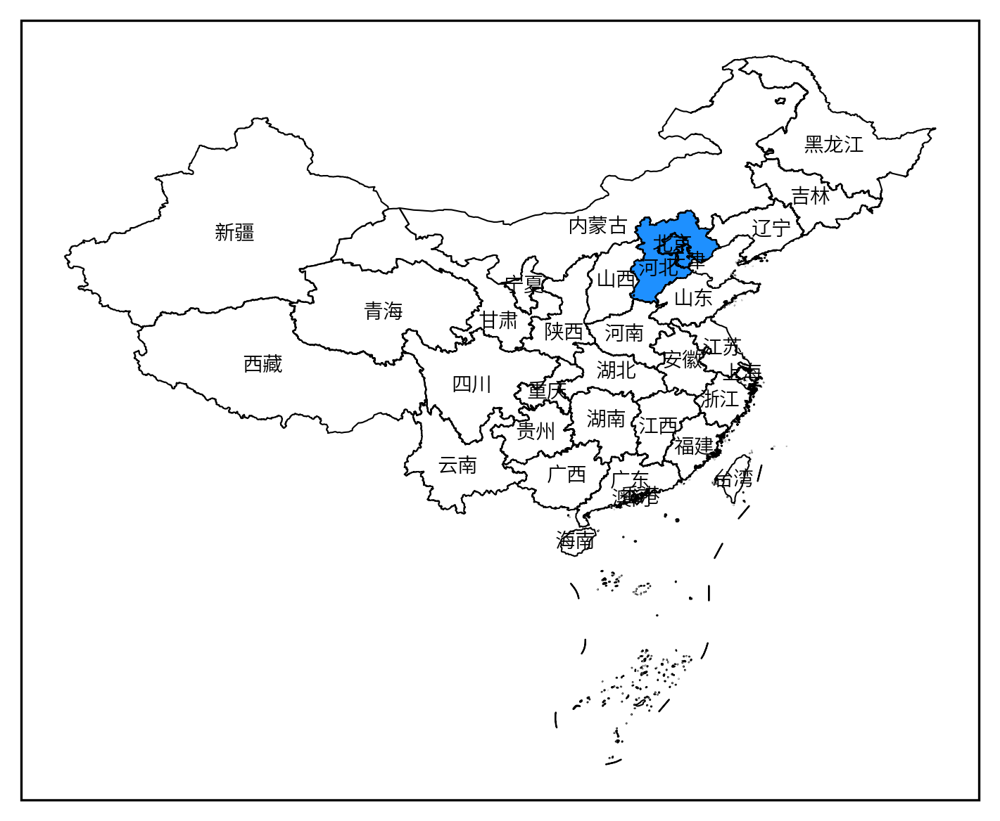
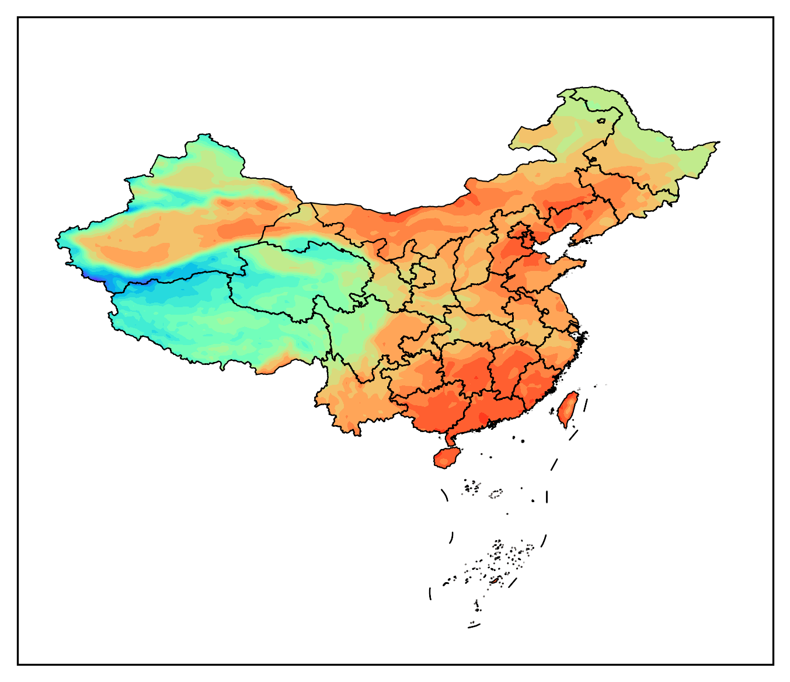
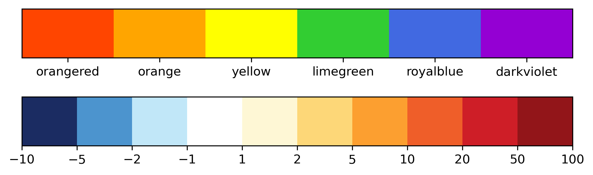
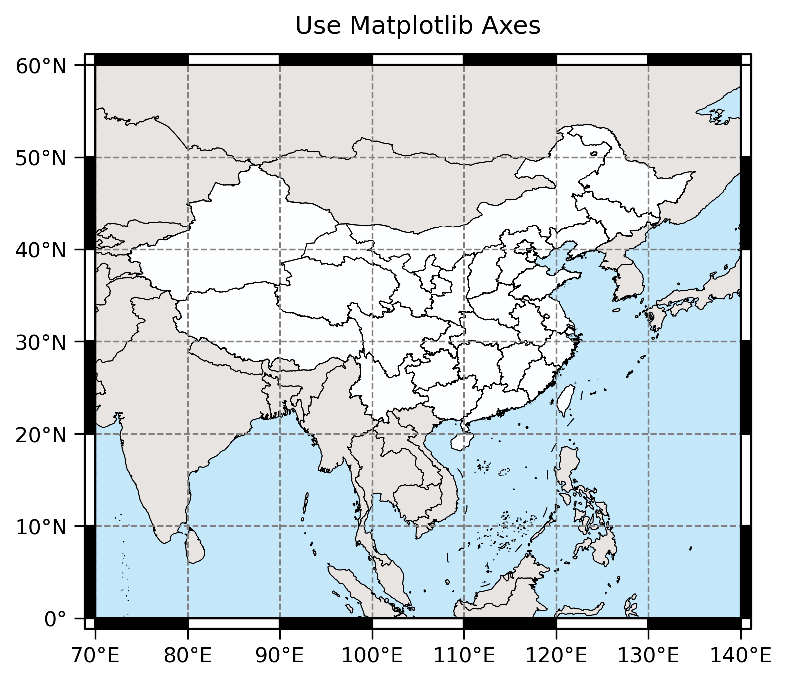
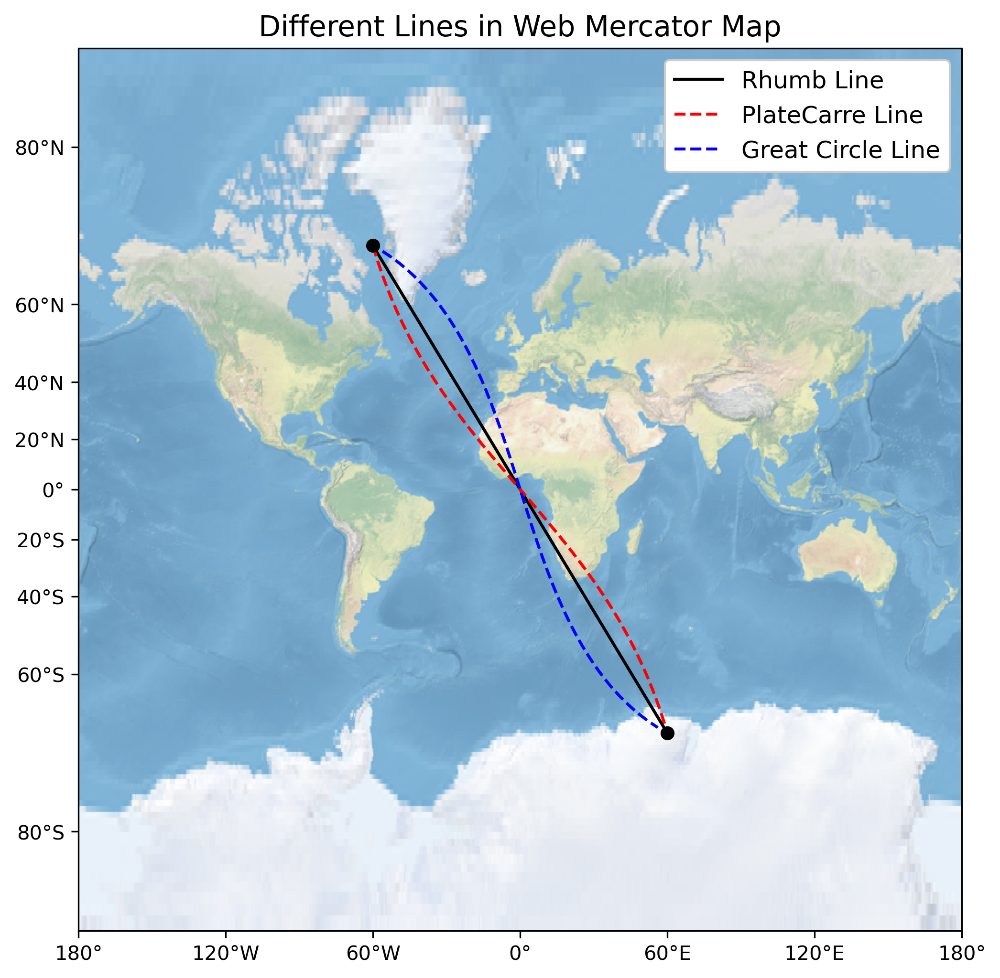
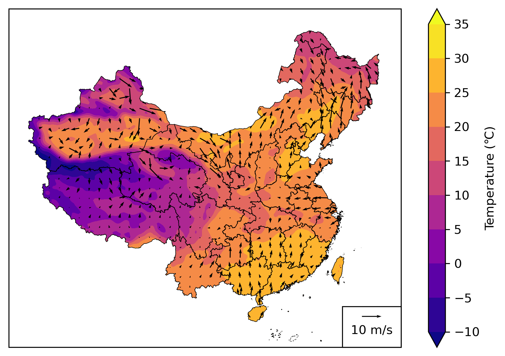
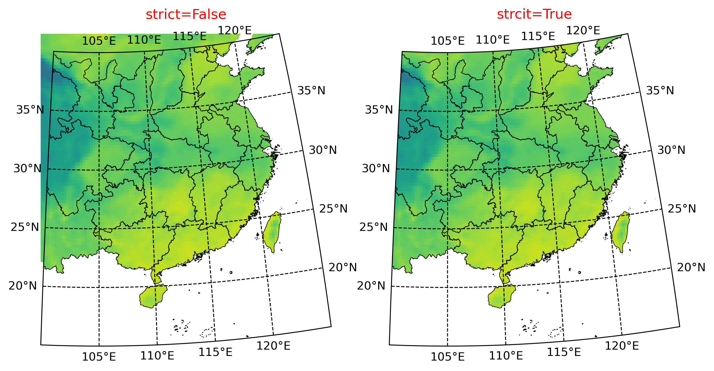

# frykit

一个配合 Matplotlib 和 Cartopy 使用的地图工具箱，主要由 `shp` 和 `plot` 模块组成。

`shp` 模块的功能是：

- 读取中国行政区划数据
- 创建多边形掩膜（mask）
- 对多边形做投影变换

`plot` 模块的功能包括：

- 绘制中国行政区划数据
- 向地图添加中国国界、省界和市界
- 利用行政区划做裁剪（clip）
- 快速设置地图范围和刻度
- 添加南海小图
- 添加风矢量图的图例
- 添加指北针
- 添加比例尺

特色是：

- 自带高德地图行政区划数据
- 可同时用于 `Axes` 或 `GeoAxes`
- 对画图速度有优化
- 对裁剪出界问题有优化

暂无文档，但是每个函数都有详细的 docstring，可以在 Python 命令行中通过 `help` 函数查看，或者在 IDE 中查看。

这个包只是作者自用的小工具集，函数编写粗糙，可能存在不少 bug，还请多多交流指正。类似的更完备的包还请移步 [cnmaps](https://github.com/cnmetlab/cnmaps)、[gma](https://gma.luosgeo.com/) 或 [EOmaps](https://github.com/raphaelquast/EOmaps)。

## 安装

```
pip install frykit
```

依赖为：

```
python>=3.9.0
cartopy>=0.20.0
pandas>=1.2.0
```

Python 版本较低时可以手动指定版本

```
pip install frykit==0.2.5
```

不过 API 跟最新版有很大区别。

## 更新记录

[CHANGELOG.md](CHANGELOG.md)

## 使用指南

### 读取中国行政区划

`get_cn_xxx` 系列函数能读取中国行政区划，返回 [Shapely](https://shapely.readthedocs.io/en/stable/manual.html) 多边形对象。具体来说：

- `get_cn_border`：读取国界。
- `get_nine_line`：读取九段线。
- `get_cn_province`：读取省界。默认返回所有省，也可以通过省名指定单个省或多个省。
- `get_cn_city`：读取市界。默认返回所有市。可以
  - 通过市名指定单个市或多个市。
  - 通过省名指定单个省或多个省包含的所有市。

```Python
import frykit.shp as fshp

border = fshp.get_cn_border()
nine_line = fshp.get_nine_line()

provinces = fshp.get_cn_province()
anhui = fshp.get_cn_province('安徽省')
anhui, jiangsu = fshp.get_cn_province(['安徽省', '江苏省'])

cities = fshp.get_cn_city()
hefei = fshp.get_cn_city('合肥市')
hefei, luan = fshp.get_cn_city(['合肥市', '六安市'])

cities_of_anhui = fshp.get_cn_city(province='安徽省')
cities_of_anhui_and_jiangsu = fshp.get_cn_city(province=['安徽省', '江苏省'])
```

行政区划源数据来自 [高德地图行政区域查询接口](https://lbs.amap.com/api/webservice/guide/api/district)，已从 GCJ-02 坐标系处理到了 WGS84 坐标系上。文件都在 `frykit.DATA_DIRPATH` 指向的目录里。制作方法见 [amap-shp](https://github.com/ZhaJiMan/amap-shp)。

暂无县界，可以使用 [ChinaAdminDivisonSHP](https://github.com/GaryBikini/ChinaAdminDivisonSHP) 或 [CTAmap](https://www.shengshixian.com/) 的数据。

### 绘制中国行政区划

- `add_cn_border`：绘制国界。
- `add_nine_line`：绘制九段线。
- `add_cn_province`：绘制省界。
- `add_cn_city`：绘制市界。

另外还提供两个标注名字的函数：

- `label_cn_province`：标注省名。
- `label_cn_city`：标注市名。

画出所有省份，同时用颜色区分京津冀地区：

```Python
import matplotlib.pyplot as plt
import cartopy.crs as ccrs
import frykit.plot as fplt

plt.figure(figsize=(8, 8))
ax = plt.axes(projection=ccrs.PlateCarree())
fplt.add_cn_province(ax)
fplt.add_cn_province(ax, ['北京市', '天津市', '河北省'], fc='dodgerblue')
fplt.add_nine_line(ax)
fplt.label_cn_province(ax)

plt.show()
```



### 绘制任意多边形

`add_cn_border` 函数相当于

```Python
add_polygons(ax, get_cn_border())
```

底层的 `add_polygons` 可以用来绘制任意 Shapely 多边形对象。

画一个半径为 10 的圆：

```Python
import shapely.geometry as sgeom

circle = sgeom.Point(0, 0).buffer(10)
fplt.add_polygons(ax, circle)
```

配合 Cartopy 的 `Reader` 画自己提供的 shapefile：

```Python
from cartopy.io.shapereader import Reader

reader = Reader('2023年_CTAmap_1.12版/2023年县级/2023年县级.shp')
fplt.add_polygons(ax, reader.geometries(), fc='none', ec='k', lw=0.25)
```

通过 `array`、 `cmap` 和 `norm` 参数还能实现类似分省填色的效果（详见 [fill.py](example/fill.py)）。

`add_polygons` 默认直接用 pyproj 做地图投影变换，速度更快但也更容易出现错误的效果。可以指定参数 `fast_transform=False`，切换成更正确但速度更慢的模式。或者直接换用 Cartopy 的 `add_geometries`。

### 裁剪 Artist

这里 Artist 泛指 Matplotlib 里 `contourf`、 `pcolormesh`、 `imshow`、 `quiver`、 `scatter` 等方法返回的对象。

- `clip_by_cn_border`：用国界裁剪。
- `clip_by_cn_province`：用省界裁剪。
- `clip_by_cn_city`：用市界裁剪。
- `clip_by_polygon`：用任意多边形裁剪。

用国界裁剪 `contourf` 的例子：

```Python
import matplotlib.pyplot as plt
import cartopy.crs as ccrs
import frykit.plot as fplt

crs = ccrs.PlateCarree()
ax = plt.axes(projection=crs)
fplt.add_cn_province(ax)
fplt.add_nine_line(ax)

data = fplt.load_test_data()
cf = ax.contourf(
    data['longitude'],
    data['latitude'],
    data['t2m'],
    levels=20,
    cmap='rainbow',
    transform=crs
)
fplt.clip_by_cn_border(cf)

plt.show()
```



多省或多市裁剪需要提前合并成单个多边形，然后用 `clip_by_polygon` 裁剪：

```Python
from shapely.ops import unary_union

jingjinji = unary_union(fshp.get_cn_province(['北京市', '天津市', '河北省']))
fplt.clip_by_polygon(cf, jingjinji)
```

### 制作掩膜

裁剪是在画图阶段从视觉效果上屏蔽多边形外的数据，而掩膜则是在数据处理阶段对多边形外的数据进行处理，例如设为缺测。

```Python
border = fshp.get_cn_border()
mask = fshp.polygon_to_mask(border, lon, lat)
data[~mask] = np.nan
ax.contourf(lon, lat, data)
```

### 设置地图范围和刻度


`GeoAxes` 设置地图范围和刻度需要以下步骤：

```Python
import numpy as np
from cartopy.mpl.ticker import LongitudeFormatter, LatitudeFormatter

crs = ccrs.PlateCarree()
ax.set_extent([70, 140, 0, 60], crs=crs)
ax.set_xticks(np.arange(70, 141, 10), crs=crs)
ax.set_yticks(np.arange(0, 61, 10), crs=crs)
ax.xaxis.set_major_formatter(LongitudeFormatter())
ax.yaxis.set_major_formatter(LatitudeFormatter())
```

`set_map_ticks` 函数可以将这段简化成一行：

```Python
fplt.set_map_ticks(ax, [70, 140, 0, 60], dx=10, dy=10)
```

会自动根据经度间隔和纬度间隔生成刻度，并加上度数和东南西北的符号。另外还可以：

* 用 `xticks` 和 `yticks` 显式指定刻度。
* 用 `mx` 和 `my` 参数指定次刻度的数量。
* 适用于非等经纬度投影。

> 对于非等经纬度投影的 `GeoAxes`，如果显示范围不是矩形，或者范围跨越了 180 度经线，该函数可能产生错误的效果。

### 添加风矢量图例

在右下角添加一个白色矩形背景的风矢量图例：

```Python
Q = ax.quiver(x, y, u, v, transform=crs)
fplt.add_quiver_legend(Q, U=10, width=0.15, height=0.12)
```

### 添加指北针

```Python
fplt.add_compass(ax, 0.95, 0.8, size=15)
```

指北针的位置基于 `Axes` 坐标系。 `ax` 是 `GeoAxes` 时指北针会自动指向所在位置处的北向，也可以通过 `angle` 参数手动指定角度。

### 添加比例尺

```Python
scale_bar = fplt.add_scale_bar(ax1, 0.36, 0.8, length=1000)
scale_bar.set_xticks([0, 500, 1000])
```

比例尺的长度通过采样 `GeoAxes` 中心处单位长度对应的地理距离得出。比例尺对象类似 `Axes`，可以用 `set_xticks` 等方法进一步修改样式。

### 添加小地图

```Python
mini_ax = fplt.add_mini_axes(ax)
mini_ax.set_extent([105, 120, 2, 25], crs=crs)
fplt.add_cn_province(mini_ax)
fplt.add_nine_line(mini_ax)
```

小地图默认使用大地图的投影，会自动定位到大地图的角落，无需像 `add_axes` 那样需要反复调整位置。

### GMT 风格边框

```Python
fplt.add_frame(ax)
```

添加类似 [GMT](https://www.generic-mapping-tools.org/) 风格的黑白相间格子的边框。目前仅支持等经纬度或墨卡托投影的 `GeoAxes`。

### 特殊 colorbar

构造一个颜色对应一个刻度的 colorbar：

```Python
colors = [
    'orangered',
    'orange',
    'yellow',
    'limegreen',
    'royalblue',
    'darkviolet'
]
cmap, norm, ticks = fplt.get_qualitative_palette(colors)
cbar = fplt.plot_colormap(cmap, norm)
cbar.set_ticks(ticks)
cbar.set_ticklabels(colors)
```

构造零值所在区间对应白色的 colorbar：

```Python
import cmaps
boundaries = [-10, -5, -2, -1, 1, 2, 5, 10, 20, 50, 100]
norm = fplt.CenteredBoundaryNorm(boundaries)
cbar = fplt.plot_colormap(cmaps.BlueWhiteOrangeRed, norm)
cbar.set_ticks(boundaries)
```



### 详细介绍

工具箱的原理和使用场景可见下面几篇博文：

- [Cartopy 系列：探索 shapefile](https://zhajiman.github.io/post/cartopy_shapefile/)
- [Cartopy 系列：裁剪填色图出界问题](https://zhajiman.github.io/post/cartopy_clip_outside/)
- [CALIPSO L2 VFM 产品的读取和绘制（with Python）](https://zhajiman.github.io/post/calipso_vfm/)
- [Matplotlib 系列：colormap 的设置](https://zhajiman.github.io/post/matplotlib_colormap/)
- [Cartopy 添加南海小地图的三种方法](https://mp.weixin.qq.com/s/-QMVN6MS-UuQ9lQjz9vqBQ)

### 示例效果

包的 `example` 目录里有更复杂的示例脚本：

- [在普通 `Axes` 上画地图](example/axes.py)



- [墨卡托投影](example/mercator.py)



- [分省填色](example/fill.py)


- [裁剪 `contourf` 和 `quiver`](example/quiver.py)



- [裁剪出界处理](example/strict_clip.py)



- [裁剪主图和南海小图的 `contourf`](example/contourf.py)


- [模仿 NERV 风格的地图](example/nerv_style.py)


