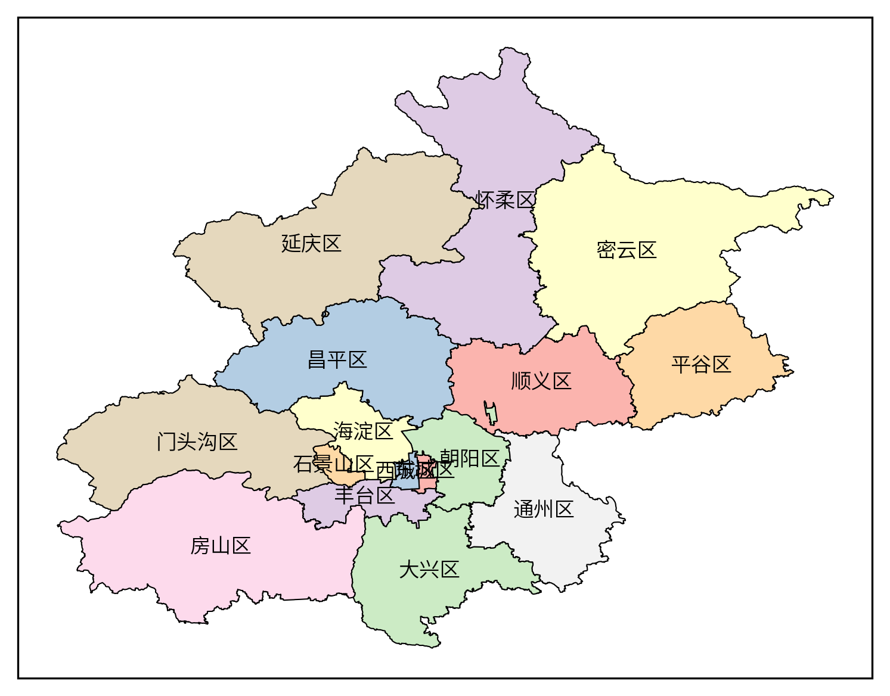

# frykit

一个配合 Matplotlib 和 Cartopy 使用的地图工具箱，主要由 `shp` 和 `plot` 模块组成。

`shp` 模块的功能是：

- 读取中国行政区划数据
- 创建多边形掩膜（mask）

`plot` 模块的功能包括：

- 绘制中国行政区划数据。
- 利用行政区划做裁剪（clip）
- 快速设置地图范围和刻度
- 添加南海小图
- 添加风矢量图的图例
- 添加指北针
- 添加比例尺

特色是：

- 自带高德地图和天地图的行政区划数据
- 可同时用于 `Axes` 和 `GeoAxes`
- 对画图速度有优化
- 对裁剪出界问题有优化

暂无文档，但是每个函数都有详细的 docstring，可以在 Python 命令行中通过 `help` 函数查看，或者在 IDE 中查看。

这个包只是作者自用的小工具集，函数编写粗糙，可能存在不少 bug，还请多多交流指正。类似的更完备的包还请移步 [cnmaps](https://github.com/cnmetlab/cnmaps)、[gma](https://gma.luosgeo.com/) 或 [EOmaps](https://github.com/raphaelquast/EOmaps)。

> 有问题直接提 issue，也可以加交流 QQ 群：1017694471

## 安装

```
# 只需要 frykit 的工具函数
pip install frykit

# 需要地图数据
pip install frykit[data]

# 更新
pip install -U frykit
```

0.7.0 开始地图数据和 frykit 本体分离，完整安装和更新需要指定 `frykit[data]`，而之前的版本简单 pip 安装即可。

具体依赖为：

```
python>=3.10.0
pandas>=1.2.0
shapely>=2.0.0
cartopy>=0.22.0
```

Python 版本不满足要求时可能装上老版本的 frykit，缺少新函数或者在运行时报错。

## 更新记录

[CHANGELOG.md](CHANGELOG.md)

## 使用指南

### 读取中国行政区划

`get_cn_xxx` 系列函数能读取中国行政区划，返回 [Shapely](https://shapely.readthedocs.io/en/stable/manual.html) 多边形对象。具体来说：

- `get_cn_border`：读取国界
- `get_cn_line`：读取九段线
- `get_cn_province`：读取省界。默认返回所有省，也可以通过省名指定单个省或多个省。
- `get_cn_city`：读取市界。默认返回所有市。
  - 通过市名指定单个市或多个市
  - 通过省名指定单个省或多个省包含的所有市
- `get_cn_district`：读取县界。默认返回所有县。
  - 通过县名指定单个县或多个县
  - 通过市名指定单个市或多个市包含的所有县
  - 通过省名指定单个省或多个省包含的所有县

```python
import frykit.shp as fshp

国界 = fshp.get_cn_border()
九段线 = fshp.get_cn_line()

所有省 = fshp.get_cn_province()
安徽省 = fshp.get_cn_province('安徽省')
安徽省, 江苏省 = fshp.get_cn_province(['安徽省', '江苏省'])

所有市 = fshp.get_cn_city()
合肥市 = fshp.get_cn_city('合肥市')
合肥市, 六安市 = fshp.get_cn_city(['合肥市', '六安市'])

安徽省的所有市 = fshp.get_cn_city(province='安徽省')
安徽省和江苏省的所有市 = fshp.get_cn_city(province=['安徽省', '江苏省'])

所有区县 = fshp.get_cn_district()
蜀山区 = fshp.get_cn_district('蜀山区')
蜀山区, 包河区 = fshp.get_cn_district(['蜀山区', '包河区'])

合肥市的所有区县 = fshp.get_cn_district(city='合肥市')
安徽省的所有区县 = fshp.get_cn_district(province='安徽省')
```

除了用字符串名称，也可以用行政区划代码（adcode）查询：

```python
北京市 = fshp.get_cn_province(110000)
京津冀 = fshp.get_cn_province([110000, 120000, 130000])
```

### 切换数据源

> 0.7 版本新增

内置两套中国行政区划数据：高德地图行政区划 API 和天地图公开的可视化数据。区别是：

- 高德数据更精细；天地图数据更精简，画图更快。
- 市级和县级区划有差异，例如天地图有台湾的区县。
- 高德数据存在飞地，例如内蒙古境内有黑龙江的飞地加格达奇区（[issue#5](https://github.com/ZhaJiMan/frykit/issues/5)）。
- 高德数据的直辖市在市级的名称从 XX 市变为 XX 城区，adcode 也不同。

默认使用高德数据。切换数据源的方法有：

```python
# 通过函数参数指定
amap_cities = fshp.get_cn_city(data_source='amap')
tianditu_cities = fshp.get_cn_city(data_source='tianditu')

# 在脚本开头设置全局数据源
import frykit
frykit.set_option({'data_source': 'tianditu'})

# 用上下文管理器临时设置数据源
with frykit.option_context({'data_source': 'tianditu'}):
    cities = fshp.get_cn_city()
    some_function(cities)
```

具体数据说明见 [frykit_data](https://github.com/ZhaJiMan/frykit_data) 仓库。

### 绘制中国行政区划

- `add_cn_border`：绘制国界
- `add_cn_line`：绘制九段线
- `add_cn_province`：绘制省界
- `add_cn_city`：绘制市界
- `add_cn_district`：绘制县界

另外还提供标注名字的函数：

- `label_cn_province`：标注省名
- `label_cn_city`：标注市名
- `label_cn_district`：标注县名

同样可以用 `data_source` 参数切换数据源。

画出所有省份，同时用颜色区分京津冀地区：

```python
import matplotlib.pyplot as plt
import frykit.plot as fplt

plt.figure(figsize=(8, 8))
ax = plt.axes(projection=fplt.PLATE_CARREE)
fplt.add_cn_province(ax)
fplt.add_cn_province(ax, ['北京市', '天津市', '河北省'], fc='dodgerblue')
fplt.add_cn_line(ax)
fplt.label_cn_province(ax)

plt.show()
```

其中 `fplt.PLATE_CARREE` 只是一个 `ccrs.PlateCarree()` 实例，这样就无需在脚本开头导入 `cartopy.crs`。


画出北京所有区：

```python
import matplotlib.pyplot as plt
import frykit.plot as fplt

ax = plt.axes(projection=fplt.PLATE_CARREE)
fplt.add_cn_district(ax, province='北京市', fc=plt.cm.Pastel1.colors)
fplt.label_cn_district(ax, province='北京市')

plt.show()
```



### 绘制世界底图

```python
# 画所有国家
fplt.add_countries(ax)

# 画海陆
fplt.add_land(ax, fc='floralwhite')
fplt.add_ocean(ax, fc='dodgerblue')
```

外国和海陆数据并不精细，仅供试用。

### 绘制任意多边形

`add_cn_border` 函数相当于

```python
fplt.add_geometries(ax, fshp.get_cn_border())
```

底层的 `add_geometries` 函数类似 Cartopy 的 `GeoAxes.add_geometries`，可以绘制 Shapely 的 `LineString` 和 `Polygon` 对象。区别是能用于普通的 `Axes`，并且对投影速度和填色有优化。

画一个半径为 10 的圆：

```python
import shapely

circle = shapely.Point(0, 0).buffer(10)
fplt.add_geometries(ax, circle)
```

画自己的 shapefile：

```python
from cartopy.io.shapereader import Reader

reader = Reader('2023年_CTAmap_1.12版/2023年县级/2023年县级.shp')
geometries = list(reader.geometries())
reader.close()

fplt.add_geometries(ax, geometries, fc='none', ec='k', lw=0.25)
```

画自己的 GeoJSON：

```python
import json

with open('天地图_行政区划可视化/中国_省.geojson') as f:
    geojson_dict = json.load(f)
geometries = fshp.get_geojson_geometries(geojson_dict)

fplt.add_geometries(ax, geometries, fc='none', ec='k', lw=0.25)
```

通过 `array`、 `cmap` 和 `norm` 参数还能实现类似分省填色的效果（详见 [fill.py](example/fill.py)）。

`add_geometries` 默认直接用 pyproj 做地图投影变换，速度更快但也更容易出现错误的效果。可以指定参数 `fast_transform=False`，切换成更正确但速度更慢的模式。或者改用 `GeoAxes.add_geometries`。

### 裁剪 Artist

这里 Artist 泛指 Matplotlib 里 `contourf`、 `pcolormesh`、 `imshow`、 `quiver`、 `scatter` 等方法返回的对象。

- `clip_by_cn_border`：用国界裁剪。
- `clip_by_cn_province`：用省界裁剪。
- `clip_by_cn_city`：用市界裁剪。
- `clip_by_cn_district`：用县界裁剪。
- `clip_by_polygon`：用任意多边形裁剪。

用国界裁剪 `contourf` 的例子：

```python
import matplotlib.pyplot as plt
import frykit.plot as fplt

ax = plt.axes(projection=fplt.PLATE_CARREE)
fplt.add_cn_province(ax)
fplt.add_cn_line(ax)

data = fplt.load_test_data()
cf = ax.contourf(
    data['longitude'],
    data['latitude'],
    data['t2m'],
    levels=20,
    cmap='rainbow',
    transform=fplt.PLATE_CARREE,
)
fplt.clip_by_cn_border(cf)

plt.show()
```


多省裁剪直接传入列表即可：

```python
fplt.clip_by_cn_province(artist, ['北京市', '天津市', '河北省'])
```

更复杂的裁剪需要手动处理多边形：

```python
北京市 = fshp.get_cn_province('北京市')
保定市 = fshp.get_cn_city('保定市')
张家口市 = fshp.get_cn_city('张家口市')
polygon = shapely.union_all([北京市, 保定市, 张家口市])
fplt.clip_by_polygon(artist, polygon)
```

### 制作掩膜

裁剪是在画图阶段从视觉效果上屏蔽多边形外的数据，而掩膜则是在数据处理阶段对多边形外的数据进行处理，例如设为缺测。

```python
border = fshp.get_cn_border()
mask = fshp.polygon_mask(border, lon2d, lat2d)
data[~mask] = np.nan
ax.contourf(lon2d, lat2d, data)
```

如果数据坐标能用二维直线网格描述，那么还提供更优化的 `polygon_mask2` 函数：

```python
mask = fshp.polygon_mask2(border, lon1d, lat1d)
data[~mask] = np.nan
```

### 设置地图范围和刻度

`GeoAxes` 设置地图范围和刻度需要以下步骤：

```python
import numpy as np
import cartopy.crs as ccrs
from cartopy.mpl.ticker import LongitudeFormatter, LatitudeFormatter

crs = ccrs.PlateCarree()
ax.set_extent((70, 140, 0, 60), crs=crs)
ax.set_xticks(np.arange(70, 141, 10), crs=crs)
ax.set_yticks(np.arange(0, 61, 10), crs=crs)
ax.xaxis.set_major_formatter(LongitudeFormatter())
ax.yaxis.set_major_formatter(LatitudeFormatter())
```

`set_map_ticks` 函数可以将这段简化成一行：

```python
fplt.set_map_ticks(ax, (70, 140, 0, 60), dx=10, dy=10)
```

会自动根据经度间隔和纬度间隔生成刻度，并加上度数和东南西北的符号。另外还可以：

* 用 `xticks` 和 `yticks` 显式指定刻度。
* 用 `mx` 和 `my` 参数指定次刻度的数量。
* 适用于非等经纬度投影。

> 对于非等经纬度投影的 `GeoAxes`，如果显示范围不是矩形，或者范围跨越了 180 度经线，该函数可能产生错误的效果。

### 添加风矢量图例

在右下角添加一个白色矩形背景的风矢量图例：

```python
Q = ax.quiver(x, y, u, v, transform=fplt.PLATE_CARREE)
fplt.add_quiver_legend(Q, U=10, width=0.15, height=0.12)
```

### 添加指北针

```python
fplt.add_compass(ax, 0.95, 0.8, size=15)
```

指北针的位置基于 `Axes` 坐标系。 `ax` 是 `GeoAxes` 时指北针会自动指向所在位置处的北向，也可以通过 `angle` 参数手动指定角度。

### 添加比例尺

```python
scale_bar = fplt.add_scale_bar(ax, 0.36, 0.8, length=1000)
scale_bar.set_xticks([0, 500, 1000])
```

比例尺的长度通过采样 `GeoAxes` 中心处单位长度对应的地理距离得出。比例尺对象类似 `Axes`，可以用 `set_xticks` 等方法进一步修改样式。

### 添加小地图

```python
mini_ax = fplt.add_mini_axes(ax)
mini_ax.set_extent((105, 120, 2, 25), crs=fplt.PLATE_CARREE)
fplt.add_cn_province(mini_ax)
fplt.add_cn_line(mini_ax)
```

小地图默认使用大地图的投影，会自动定位到大地图的角落，无需像 `add_axes` 那样需要反复调整位置。

### GMT 风格边框

```python
fplt.add_frame(ax)
```

添加类似 [GMT](https://www.generic-mapping-tools.org/) 风格的黑白相间格子的边框。目前仅支持等经纬度或墨卡托投影的 `GeoAxes`。

也可以用来制作 GMT 风格的比例尺：

```python
fplt.add_frame(scale_bar)
```

### 特殊 colorbar

构造一个颜色对应一个刻度的 colorbar：

```python
colors = [
    'orangered',
    'orange',
    'yellow',
    'limegreen',
    'royalblue',
    'darkviolet'
]
cmap, norm, ticks = fplt.make_qualitative_palette(colors)
cbar = fplt.plot_colormap(cmap, norm)
cbar.set_ticks(ticks)
cbar.set_ticklabels(colors)
```

构造零值所在区间对应白色的 colorbar：

```python
import cmaps

boundaries = [-10, -5, -2, -1, 1, 2, 5, 10, 20, 50, 100]
norm = fplt.CenteredBoundaryNorm(boundaries)
cbar = fplt.plot_colormap(cmaps.BlueWhiteOrangeRed, norm)
cbar.set_ticks(boundaries)
```


## 性能测试

Cartopy 和 frykit 绘制行政区划的耗时如下表所示：

<table><thead><tr><th rowspan="3">范围</th><th rowspan="3">区划</th><th colspan="3">cartopy</th><th colspan="3">frykit</th></tr><tr><th>1</th><th>2</th><th>3</th><th>1</th><th>2</th><th>3</th></tr></thead><tbody><tr><td rowspan="4">全国</td><td>国</td><td>4.75</td><td>0.15</td><td>0.18</td><td>0.65</td><td>0.16</td><td>0.15</td></tr><tr><td>省</td><td>15.23</td><td>0.20</td><td>0.21</td><td>0.96</td><td>0.21</td><td>0.28</td></tr><tr><td>市</td><td>41.31</td><td>0.43</td><td>0.45</td><td>1.92</td><td>0.40</td><td>0.44</td></tr><tr><td>县</td><td>96.16</td><td>0.83</td><td>0.83</td><td>4.09</td><td>0.86</td><td>0.83</td></tr><tr><td rowspan="4">南方</td><td>国</td><td>3.97</td><td>0.11</td><td>0.11</td><td>0.51</td><td>0.11</td><td>0.09</td></tr><tr><td>省</td><td>16.02</td><td>0.12</td><td>0.14</td><td>0.42</td><td>0.11</td><td>0.11</td></tr><tr><td>市</td><td>40.03</td><td>0.14</td><td>0.14</td><td>0.53</td><td>0.15</td><td>0.18</td></tr><tr><td>县</td><td>92.76</td><td>0.26</td><td>0.26</td><td>0.83</td><td>0.20</td><td>0.20</td></tr></tbody></table>

```
# 环境版本
python==3.11.9
cartopy==0.24.0
frykit==0.7.2.post1
```

- 使用高德数据
- 使用等距方位投影，以体现直接用 pyproj 和用 Cartopoy 做投影的时间差异。
- `cartopy>=0.23` 时即便 `GeoAxes` 的范围很小，仍需要对范围外的所有多边形做投影，导致速度很慢。而 frykit 对此有优化。因此这里设置两种地图范围：全国 `(70, 140, 0, 60)` 和南方 `(115, 120, 24, 28)`。
- 比较连续画三张图的结果，缓存机制会使第一次耗时最长，后续耗时大幅缩短。

测试脚本见 [script/measure_time.py](script/measure_time.py)

## 详细介绍

工具箱的原理和使用场景可见下面几篇博文：

- [Cartopy 系列：画中国地图的工具箱 frykit](https://zhajiman.github.io/post/frykit/)
- [Cartopy 系列：探索 shapefile](https://zhajiman.github.io/post/cartopy_shapefile/)
- [Cartopy 系列：裁剪填色图出界问题](https://zhajiman.github.io/post/cartopy_clip_outside/)
- [Cartopy 添加南海小地图的三种方法](https://mp.weixin.qq.com/s/-QMVN6MS-UuQ9lQjz9vqBQ)
- [Matplotlib 系列：colormap 的设置](https://zhajiman.github.io/post/matplotlib_colormap/)
- [天地图"带审图号"的行政区划数据](http://bbs.06climate.com/forum.php?mod=viewthread&tid=109893)

## 示例效果

仓库的 `example` 目录里有更复杂的示例脚本：

- [在普通 `Axes` 上画地图](example/axes.py)


- [分省填色](example/fill.py)


- [裁剪 `contourf` 和 `quiver`](example/quiver.py)


- [裁剪出界处理](example/strict_clip.py)


- [裁剪主图和南海小图的 `contourf`](example/contourf.py)


- [模仿 NERV 风格的地图](example/nerv_style.py)


