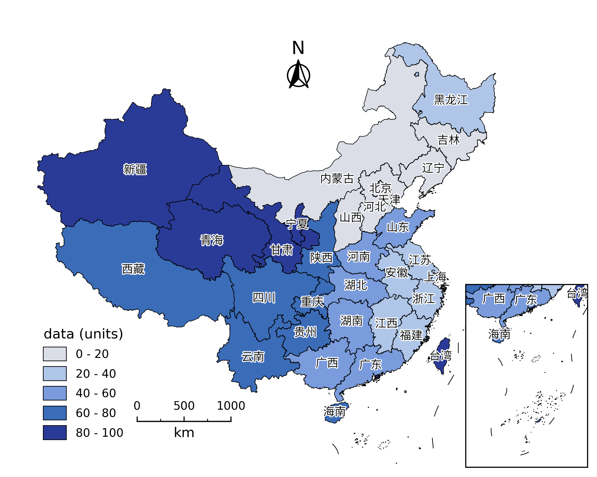

# frykit

一个配合 Matplotlib 和 Cartopy 使用的工具箱，主要提供添加刻度和绘制中国行政区划等功能。

## 安装

```
pip install frykit
```

依赖仅需 `cartopy>=0.20.0`。

## 示例

为兰伯特投影的 `GeoAxes` 添加刻度

```Python
import frykit.plot as fplot

crs = ccrs.LambertConformal(central_longitude=105, standard_parallels=(25, 47))
ax = fig.add_subplot(111, projection=crs)

fplt.set_extent_and_ticks(
    ax, extents=[74, 136, 14, 56],
    xticks=np.arange(50, 161, 10),
    yticks=np.arange(0, 71, 10),
    grid=True, lw=0.5, ls='--', color='gray'
)
```

获取代表中国行政区划的多边形对象

```Python
import frykit.shp as fshp

country = fshp.get_cnshp(level='国')
provinces = fshp.get_cnshp(level='省')
```

行政区划的 shapefile 文件来自 [ChinaAdminDivisonSHP](https://github.com/GaryBikini/ChinaAdminDivisonSHP) 项目，坐标已从 GCJ-02 坐标系处理到了 WGS84 坐标系上。

在 `Axes` 或 `GeoAxes` 上直接绘制中国省界和九段线

```Python
fplt.add_cn_province(ax, lw=0.3)
fplt.add_nine_line(ax, lw=0.5)
```

添加自备的多边形对象并填色

```Python
pc = fplt.add_polygons(
    ax, polygons, ccrs.PlateCarree(), array=data,
    cmap=cmap, norm=norm, ec='k', lw=0.4
)
cbar = fig.colorbar(pc, ax=ax)
```

用国界裁剪等值线填色图

```Python
cf = ax.contourf(
    lon, lat, data, levels, cmap='turbo',
    extend='both', transform=ccrs.PlateCarree()
)
fplt.clip_by_cn_border(cf, fix=True)
```

添加指北针和比例尺

```Python
fplt.add_north_arrow(ax, (0.95, 0.9))
fplt.add_map_scale(ax, (0.1, 0.1), length=1000, ticks=[0, 500, 1000])
```

定位南海地图

```Python
sub = fig.add_axes(ax.get_position(), projection=crs_map)
<plotting on sub>
fplt.locate_sub_axes(ax, sub, shrink=0.4)
```

效果如下图所示





示例代码请见 `test` 目录。